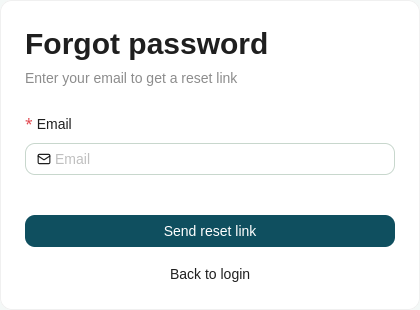
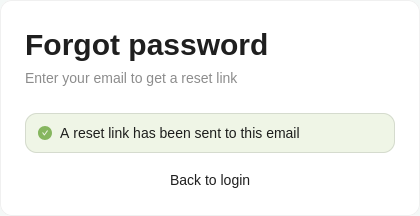
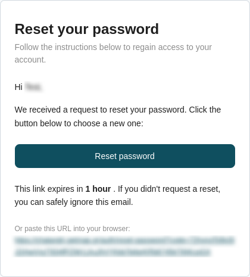
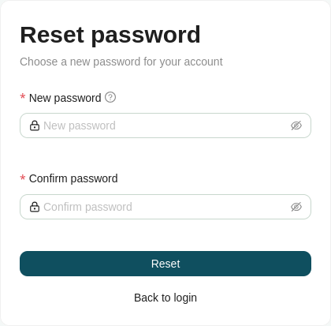

# Forgot Password

If you have forgotten your password on the [Log In](log-in.md) form, click the **Forgot Password** link. You are taken to a new page with a form to enter your email.

1. Enter your **Email** and submit the form.
2. If the email is valid, a password reset link is sent to your email account.

Click the reset link in the email to open the password reset page, where you enter your new password in two fields: **New password** and **Confirm password**.

!!! note "Password requirements"

    Your password must contain at least one uppercase letter, one number, and one special character.

On a successful password change, TBD.

