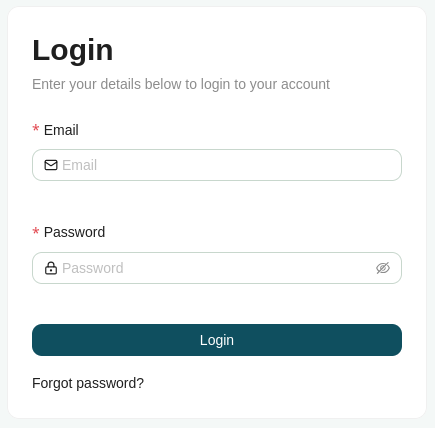

# Login

Access to the GET SDI administration is granted by logging in with your account. Accounts are created by the platform's administrators.

To login:

1. Click the **Login** button to open the login page.
2. Enter your **Email** and **Password**.
3. Click **Login**.

On a successful login, you are redirected based on your user type: administrators are taken to the admin panel, while other users are directed to the home page.

