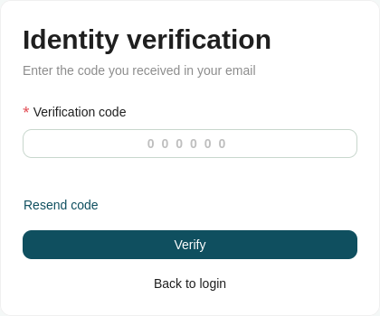
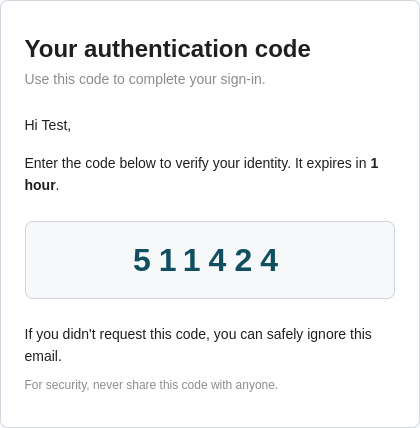

# Two-Factor Authentication

If you have enabled two-factor authentication from your [User Settings](../user/user-settings.md#two-factor-authentication), every [Log In](log-in.md) attempt requires an additional verification step. After entering your credentials, a one-time password (OTP) is sent to your email account, and you are taken to the two-factor authentication form.

1. Retrieve the OTP from the email sent to your account.
2. Enter the OTP into the **One-time password** field on the form.
3. Submit the form to complete your login.

!!! note

    If the OTP does not arrive, you can request a new one using the **Resend** option. This becomes available again only after a short countdown timer has elapsed.