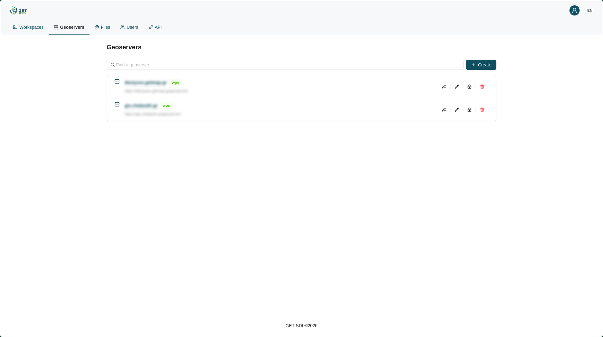
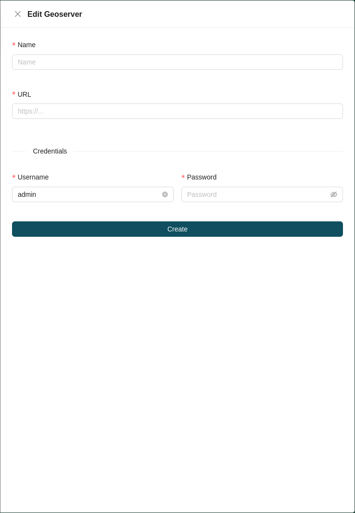
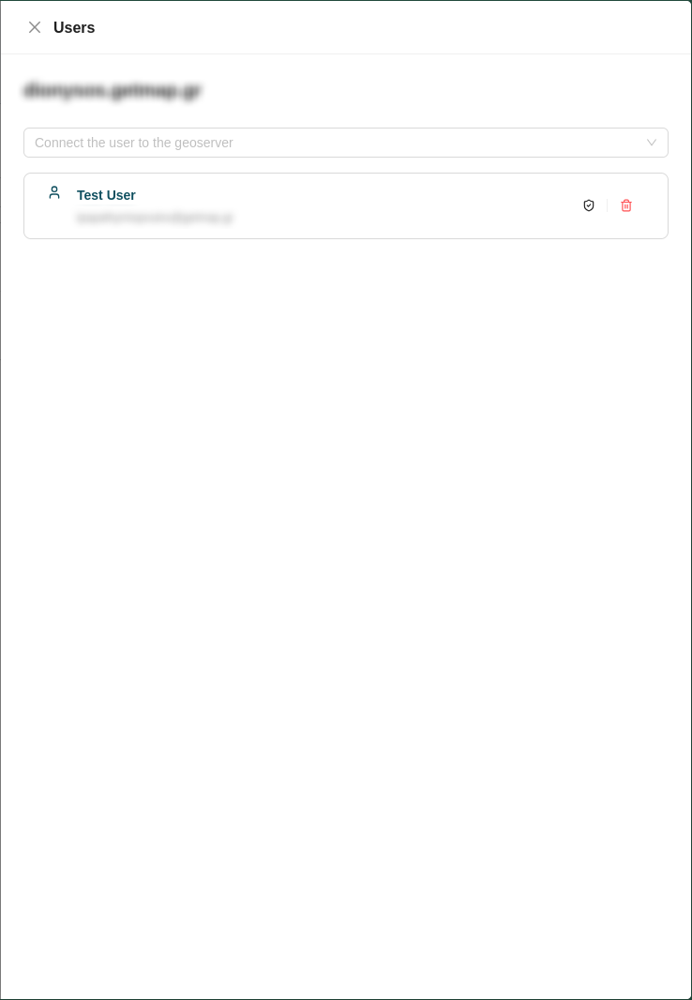
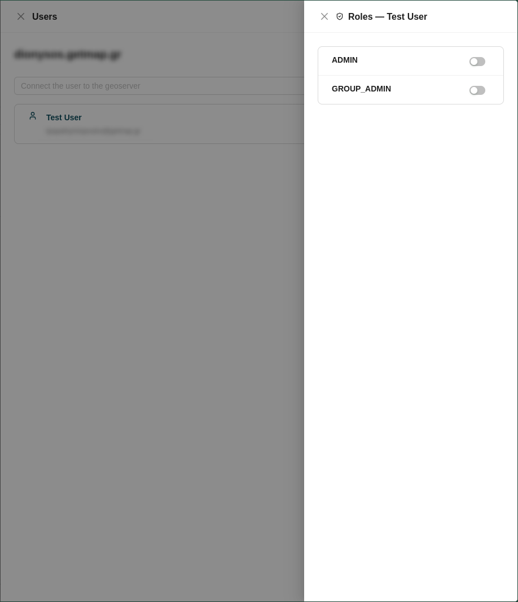
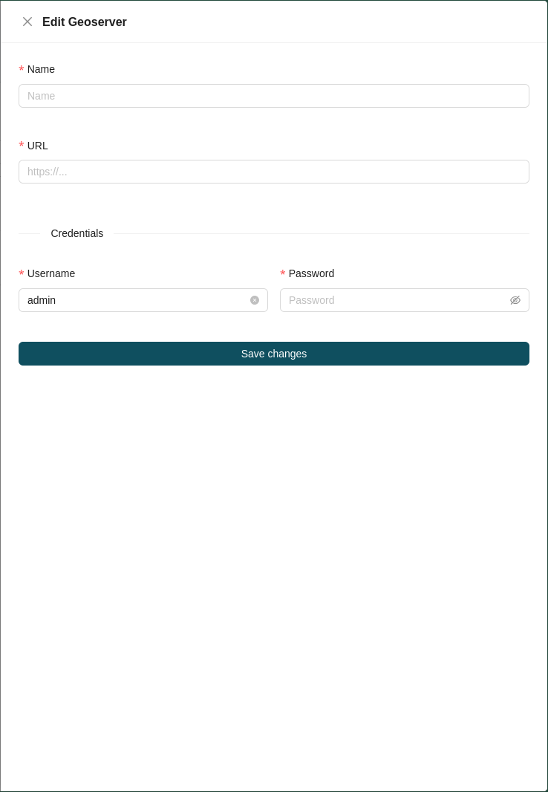
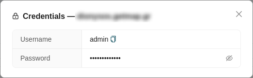

# Geoserver Management

Geoserver management is handled from the **Geoservers** tab of the administration page. A searchable, paginated list of all available geoservers is displayed, with each entry showing the geoserver's **name**, **URL**, and whether **WPS** is enabled.

!!! info "What is WPS?"

    Web Processing Service (WPS) is an OGC service for the publishing of geospatial processes, algorithms, and calculations.  The main advantage of GeoServer WPS over a standalone WPS is direct integration with other GeoServer services and the data catalog, so processes can run against data already served in GeoServer rather than sending the entire data source in the request.  Process results can also be stored as a new layer in the GeoServer catalog.  It is available as a GeoServer extension and is not installed by default. For more detail, see the [GeoServer WPS documentation](https://docs.geoserver.org/latest/en/user/services/wps/index.html).

## Registering a Geoserver

A superadmin can register a geoserver by clicking the **Create** button at the top right of the geoserver list. This opens a drawer on the right side of the page containing the geoserver creation form. Fill in the following fields:

* **Name:** A name for the geoserver.
* **URL:** The geoserver's URL.
* **Admin credentials:** The admin user's geoserver **Username** and **Password**.

!!! note

    The geoserver URL should point to the GeoServer web application root and typically ends in `/geoserver`.

## Geoserver Actions

Each geoserver in the list provides a set of available actions:

| Icon | Action | Description |
| :---: | :--- | :--- |
|  | **[Users](#users)** | Manage the users assigned to the geoserver. |
|  | **[Edit](#edit)** | Modify the geoserver's details. |
|  | **[Credentials](#credentials)** | View the geoserver's admin credentials. |
|  | **[Delete](#delete)** | Permanently remove the geoserver from the platform. |

### Users

The **Users** action opens the geoserver's users form. At the top is a dropdown listing the available users you can add to the geoserver.

Below it is a list of all users on the geoserver. Each entry displays the user's name and surname along with their email, and offers two actions:

| Icon | Action | Description |
| :---: | :--- | :--- |
|  | **Manage geoserver roles** | Assign geoserver roles to the user from the available roles of that specific geoserver. |
|  | **Delete** | Unassign the user from the geoserver. |

### Edit

The **Edit** action opens the edit geoserver form, where you can change the geoserver's **Name**, **URL**, and **admin credentials**.

### Credentials

The **Credentials** action offers quick access to the geoserver credentials. It opens a modal displaying the geoserver admin user's **Username**, which can be copied, and a **Password** that can be revealed.

### Delete

Clicking the **Delete** action permanently removes the geoserver from the platform.