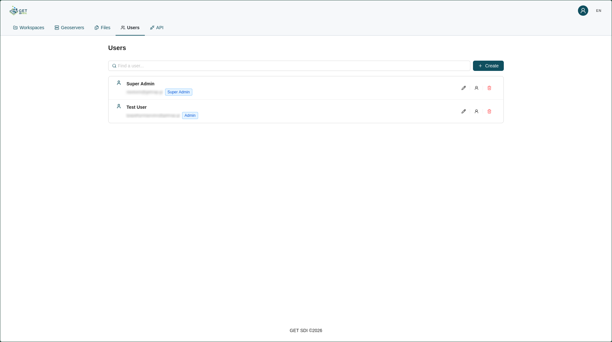
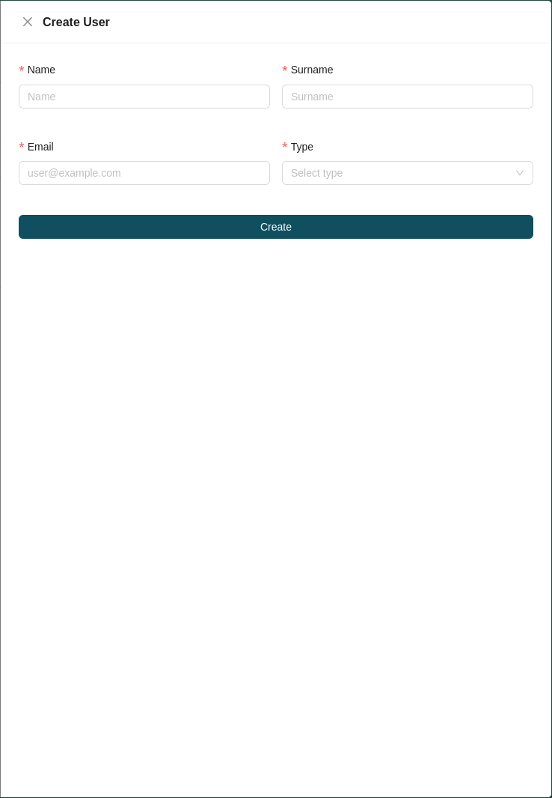
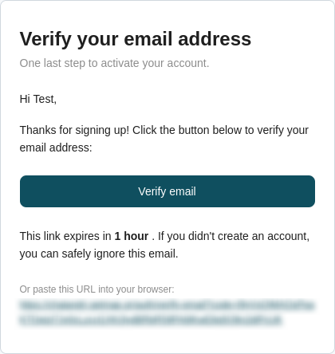
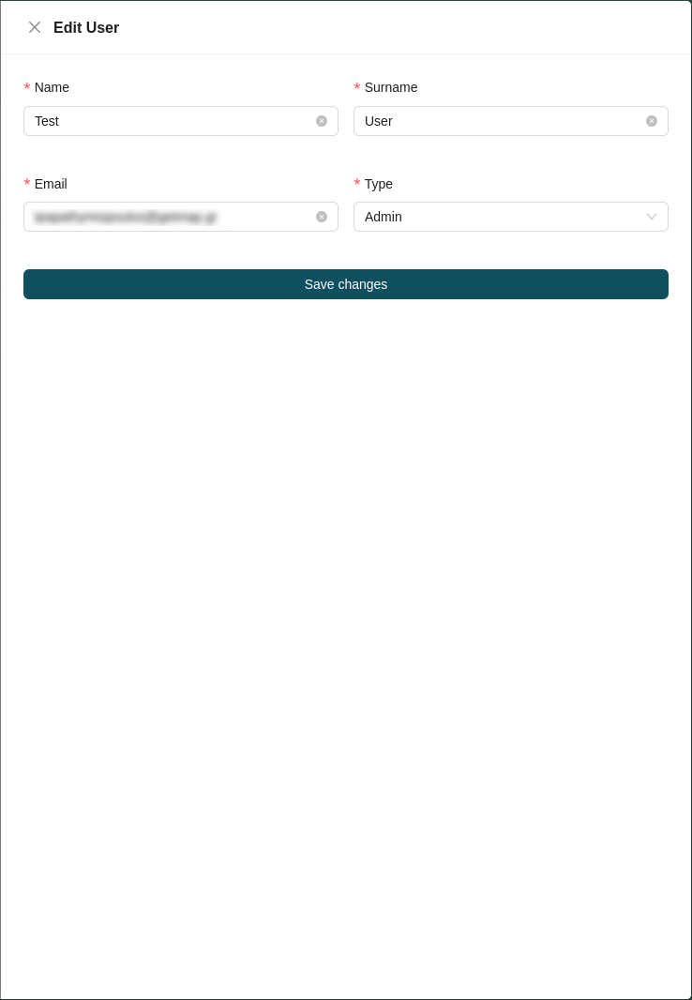
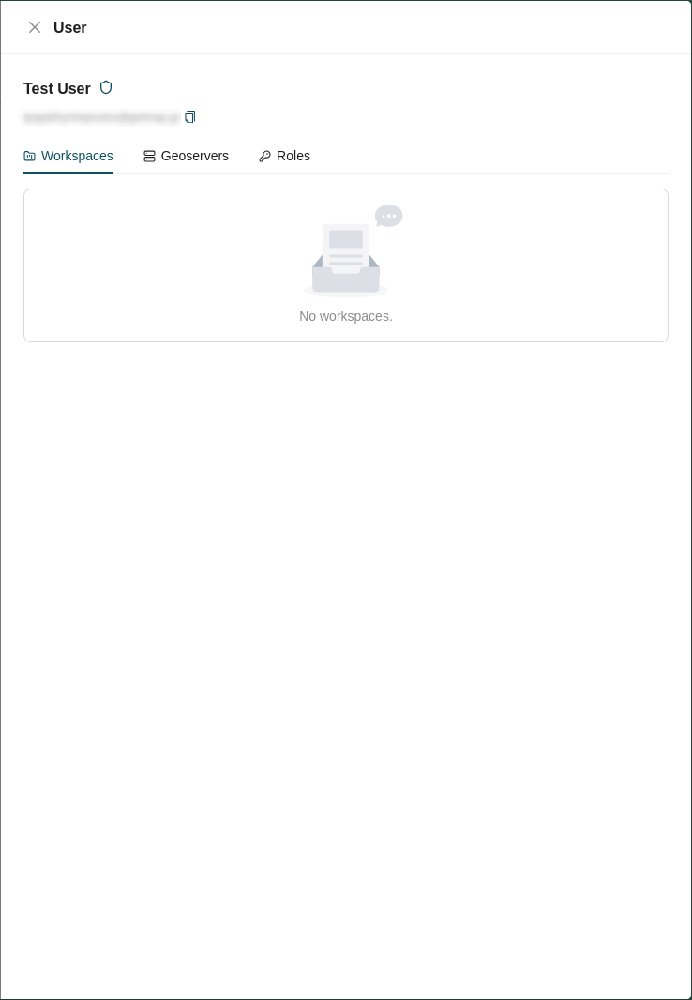
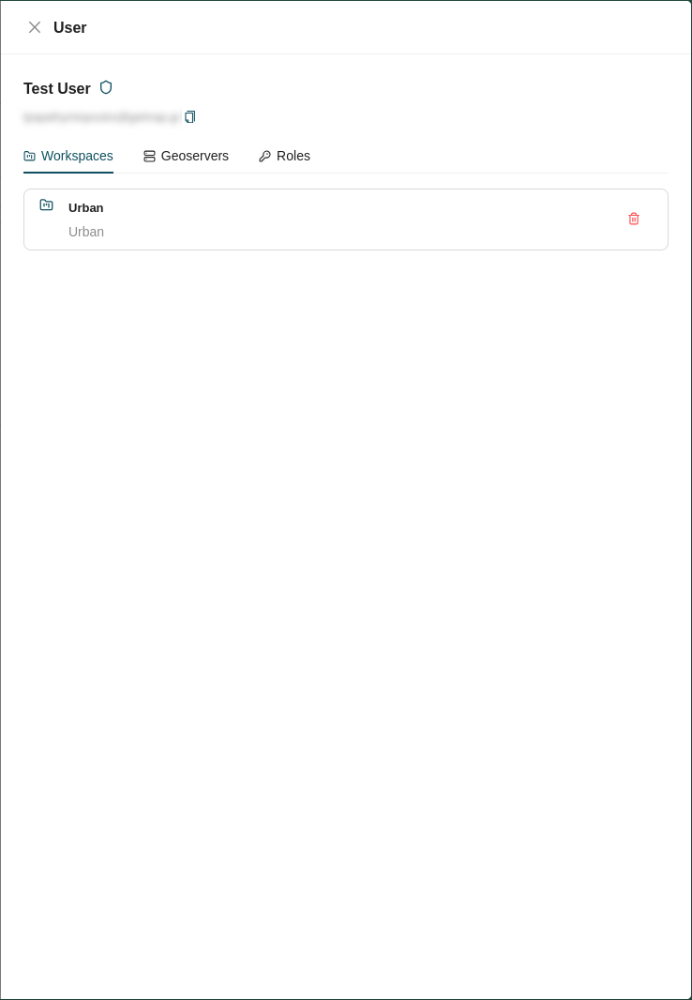
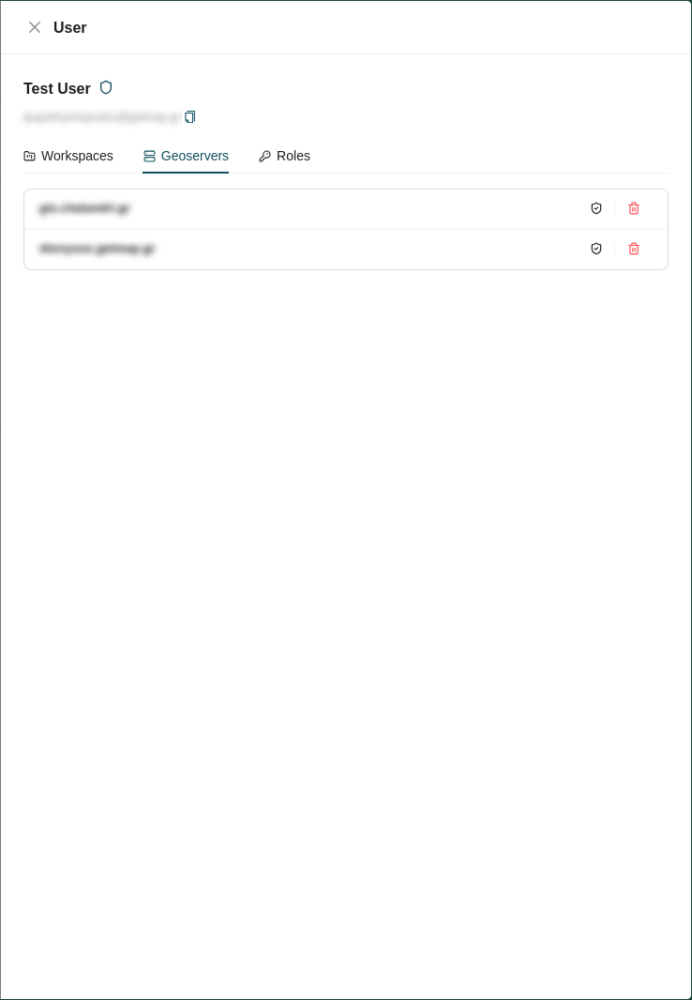
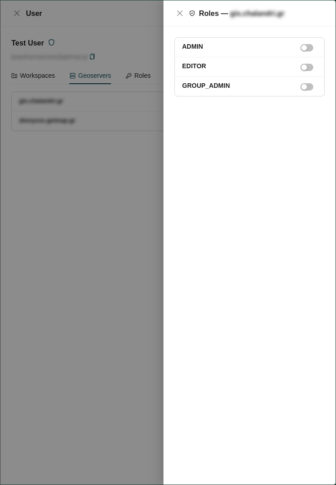
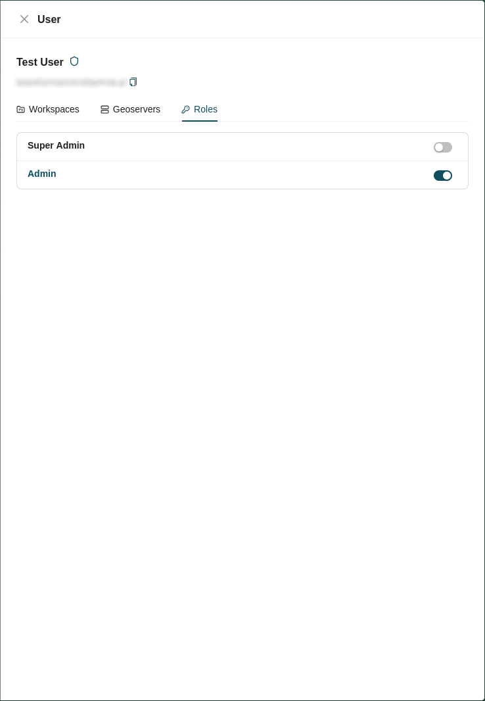

# User Management

User management is handled from the **Users** tab of the administration page. A searchable, paginated list of all available users is displayed, with each entry showing the user's name and surname, their email, and their role.

## Creating a User

A superadmin can create a user by clicking the **Create** button at the top right of the user list. This opens a drawer on the right side of the page containing the user creation form. Fill in the following fields:

* **Name:** The user's first name.
* **Surname:** The user's surname.
* **Email:** The user's email address.
* **User type:** Select the user's type: *Admin* or *Simple* (see [Roles and Types](../user/roles-and-types.md)).

!!! note "Verification and first login"

    Newly created users are automatically **unverified**. A verification email is sent to their registered account with a verification link. Clicking the link verifies the user and allows them to [Login](log-in.md) to the platform. After verification, the user should set their password by following the [Forgot Password](forgot-password.md) process.

## User Actions

Each user in the list provides a set of available actions:

| Icon | Action | Description |
| :---: | :--- | :--- |
|  | **[Edit](#edit)** | Modify the user's details. |
|  | **[Preview](#preview)** | Inspect the user's profile, workspaces, and role assignments. |
|  | **[Delete](#delete)** | Permanently remove the user from the platform. |

### Edit

Clicking the **Edit** action opens the edit user form, where a superadmin can change the user's **Name**, **Surname**, **Email**, and **Type**.

### Preview

Clicking the **Preview** action opens a drawer displaying the user's name and surname, their email, and an icon indicating their verification status:

| Icon | Status | Description |
| :---: | :--- | :--- |
|  | **Verified** | The user has confirmed their account and can Login. |
|  | **Unverified** | The user has not yet confirmed their account. |

The rest of the drawer is separated into three tabs:

#### Workspaces

The **Workspaces** tab shows the [workspaces](workspace-management.md) the user belongs to.

#### Geoserver

The **Geoserver** tab shows the [GeoServer](geoserver-management.md) instances the user has been assigned to, each with two available actions:

| Icon | Action | Description |
| :---: | :--- | :--- |
|  | **Manage roles** | Assign GeoServer roles to the user from the available roles of that specific [GeoServer](geoserver-management.md). |
|  | **Remove** | Unassign the user from that GeoServer instance. |

#### Roles

The **Roles** tab lets you assign a user role to this user (see [Roles and Types](../user/roles-and-types.md)).

### Delete

Clicking the **Delete** action permanently removes the user from the platform.