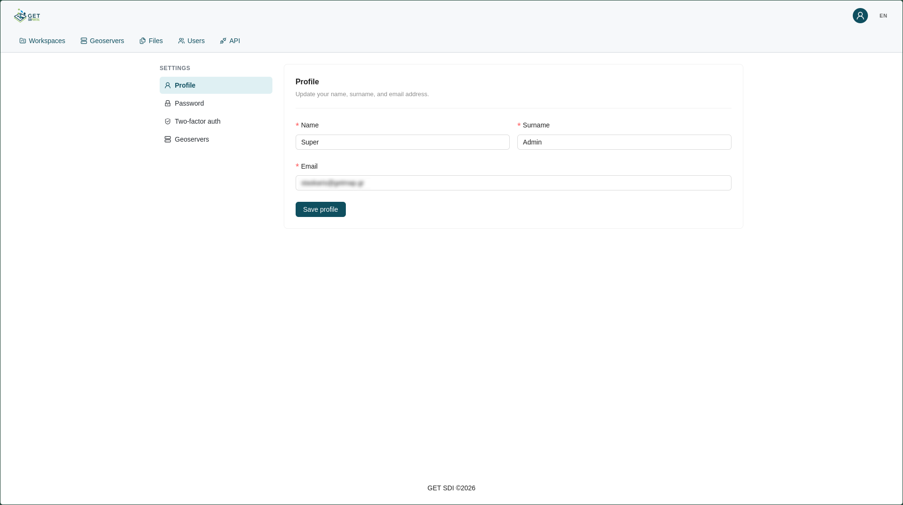
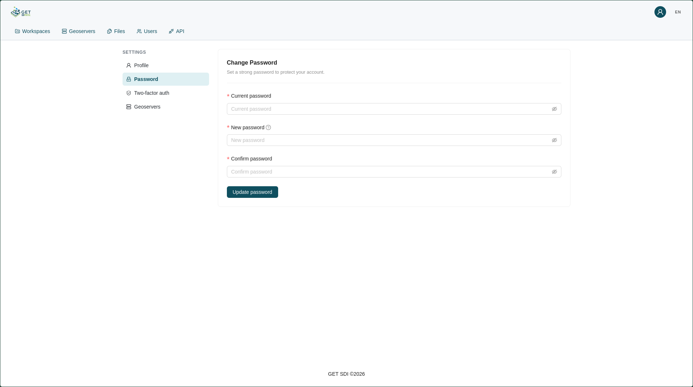
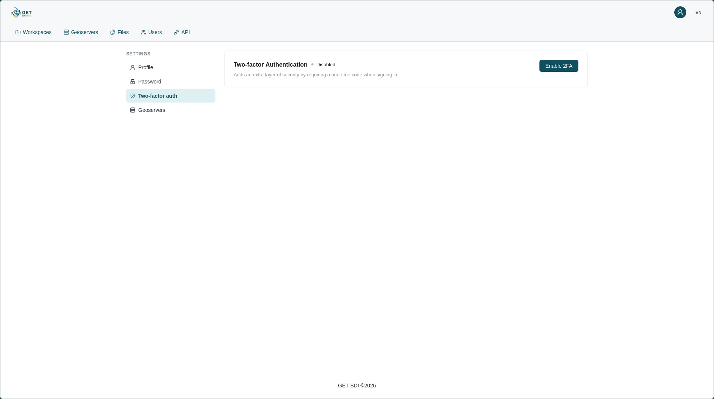
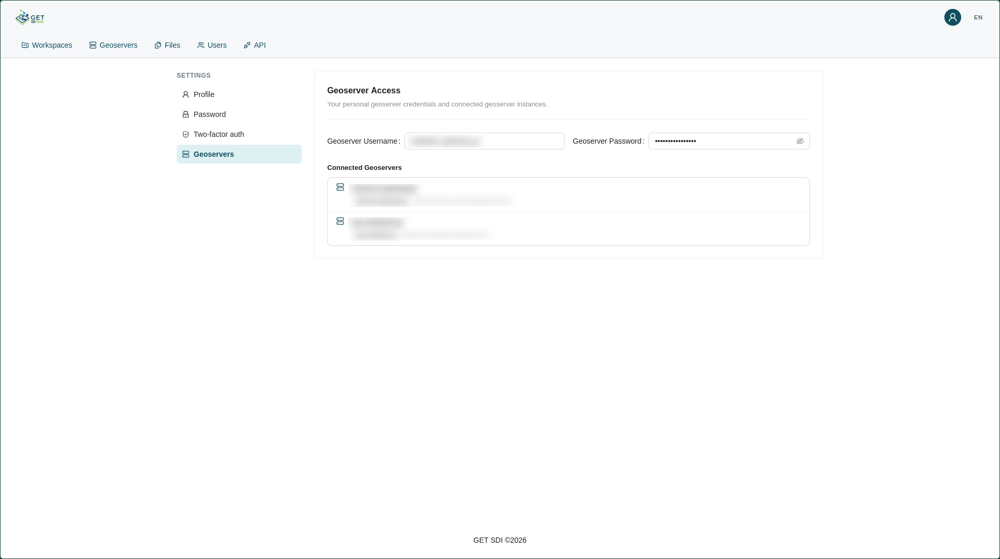

# User Settings

User settings are accessed by clicking the **user icon** at the top right of the navbar and selecting **Settings** from the dropdown that appears.

The settings are split into the following sections:

| Icon | Section | Description |
| :---: | :--- | :--- |
|  | **[Profile](#profile)** | Update your name, surname, and email. |
|  | **[Password](#password)** | Change your account password. |
|  | **[Two-Factor Authentication](#two-factor-authentication)** | Enable or disable two-factor authentication. |
|  | **[Geoserver](#geoserver)** | View your GeoServer credentials and connected instances. |

## Profile

In the **Profile** section, you can change your **Name**, **Surname**, and **Email** by filling in the corresponding form.

## Password

In the **Password** section, you can change your password by first providing your **Current password**, then entering and confirming a **New password**.

!!! note "Password requirements"

    Your password must contain at least one uppercase letter, one number, and one special character.

## Two-Factor Authentication

In the **Two-Factor Authentication** section, you can enable or disable [two-factor authentication](../access/two-factor-authentication.md) by clicking the **Enable / Disable 2FA** button.

## Geoserver

In the **Geoserver** section, you can view your GeoServer username and password, along with a list of all [GeoServer](../admin/geoserver-management.md) instances your account is connected to.

