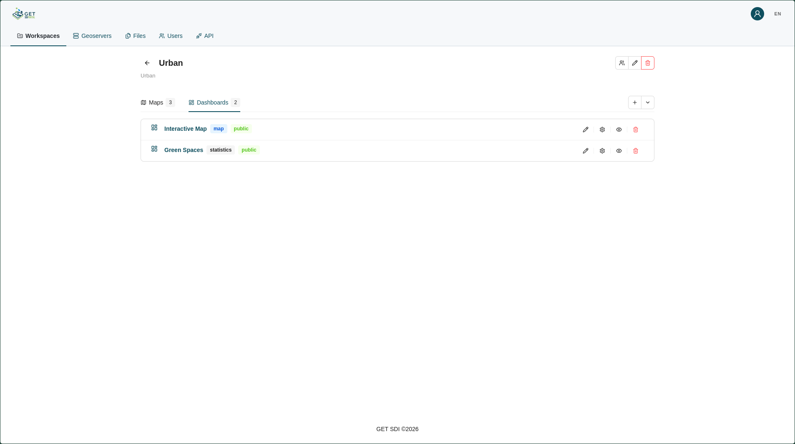
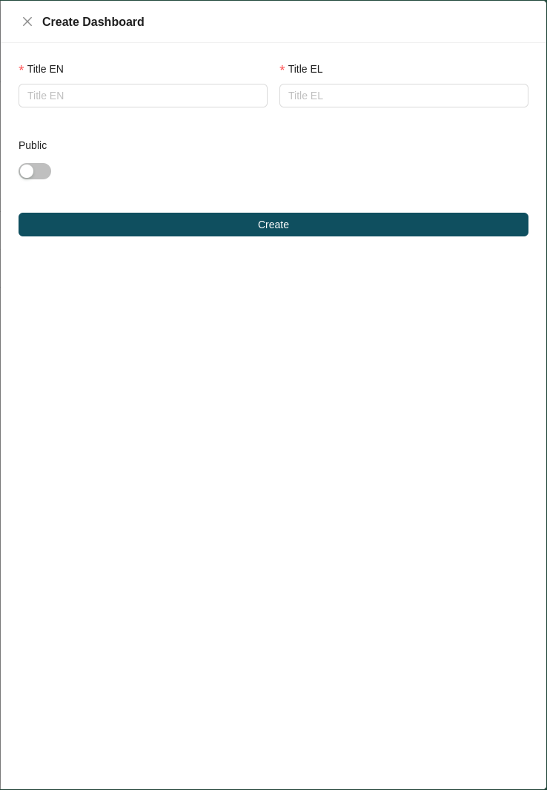
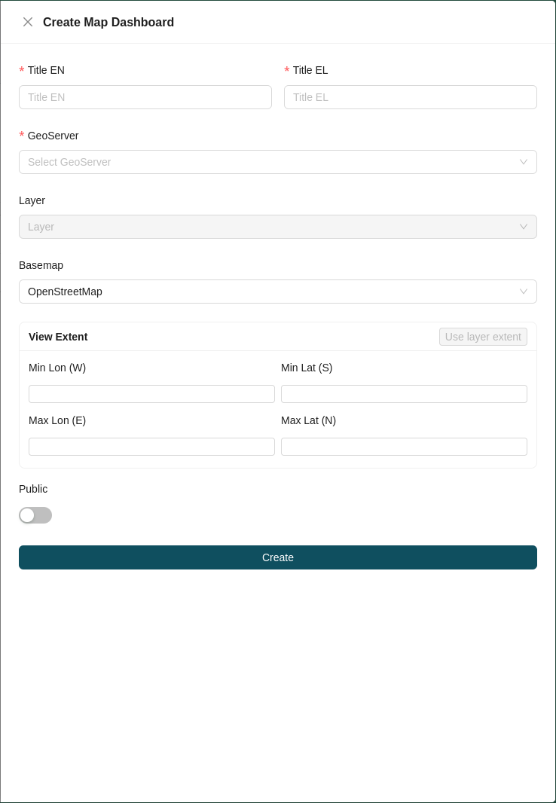
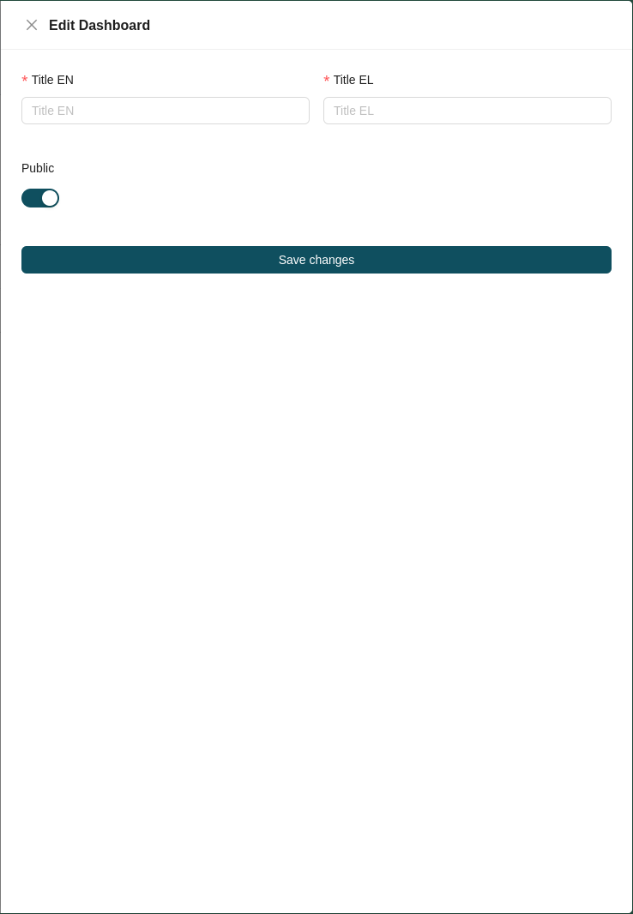
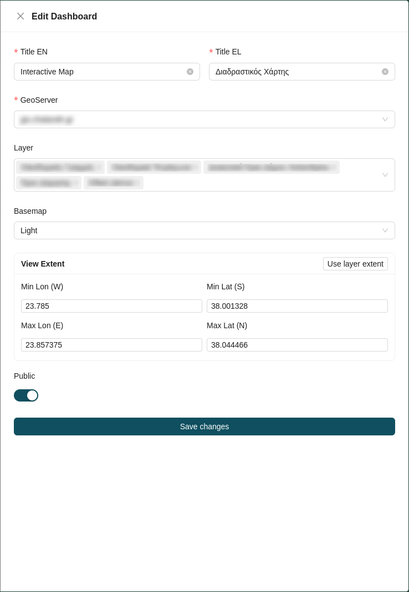
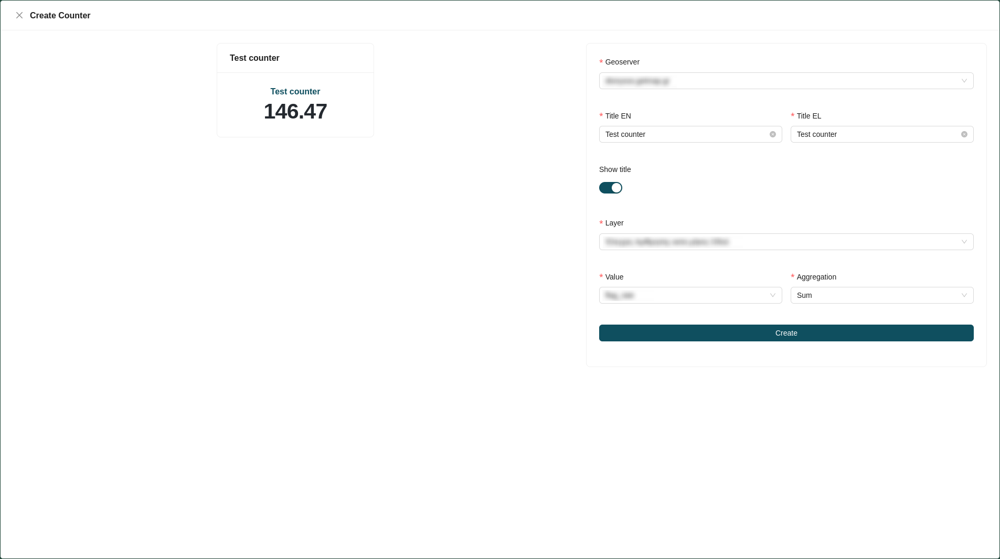

# Dashboard Management

Inside a workspace, the **Dashboards** tab displays a list of all dashboards created for that workspace. Each dashboard entry shows the dashboard's **name**, **visibility** (*Public* or *Private*) and dashboard type (*Standard/Statistics* or *Map*).

!!! note

    A **Standard Dashboard** is a grid of charts and tables for an at-a-glance overview, while a **Map Dashboard** pairs a map with charts that recalculate for whatever area you draw on it. Each is created from its own option in the create menu, for the full end-user view of both, see the [GET SDI Portal Manual](https://geospatialenablingtechnologies.github.io/get.sdi.v.6.0.0-manual/dashboard/).

## Creating a Dashboard

To create a new standard dashboard in the workspace, click the **plus** icon at the top right of the dashboard list and select **Dashboard** from the options. This opens the dashboard creation form, where you fill in the following fields:

* **Title:** The dashboard title, in all required languages.
* **Visibility:** Choose whether the dashboard is *Public* or *Private*.

## Creating a Map Dashboard

To create a new map dashboard in the workspace, click the **plus** icon at the top right of the dashboard list and select **Map Dashboard** from the options. This opens the map dashboard creation form, where you fill in the following fields:

* **GeoServer:** Choose a registered [GeoServer](geoserver-management.md).
* **Layers:** Choose one or more layers from the selected GeoServer.
* **Basemap:** Choose the basemap displayed beneath the layer.
* **View extent:** Configure the initial map extent, either by:
    * clicking **Use layer extent** to automatically apply the layer's extent, or
    * entering the bounds manually: **Min Lon (W)**, **Min Lat (S)**, **Max Lon (E)**, and **Max Lat (N)**.
* **Visibility:** Choose whether the map dashboard is *Public* or *Private*.

## Dashboard Actions

Each dashboard in the list provides a set of available actions:

| Icon | Action | Description |
| :---: | :--- | :--- |
|  | **[Edit](#edit-dashboard)** | Modify the dashboard's details. |
|  | **[Settings](#settings)** | Configure the dashboard's content and layout. |
|  | **[Preview](#preview-dashboard)** | Preview the dashboard. |
|  | **[Delete](#delete-dashboard)** | Permanently remove the dashboard from the workspace. |

### Edit Dashboard

The **Edit** action opens the edit dashboard form. There are two variants, depending on the dashboard's type.

#### Edit Standard Dashboard

For a standard dashboard, the edit form lets you change the dashboard's **Title** (in all required languages) and **Visibility** (*Public* or *Private*).

#### Edit Map Dashboard

For a map dashboard, the edit form additionally lets you change the map configuration:

* **GeoServer:** The registered [GeoServer](geoserver-management.md) the dashboard reads from.
* **Layers:** The layers from the selected GeoServer.
* **Basemap:** The basemap displayed beneath the layer.
* **View extent:** The initial map extent, set with **Use layer extent** or by entering **Min Lon (W)**, **Min Lat (S)**, **Max Lon (E)**, and **Max Lat (N)** manually.
* **Visibility:** Choose whether the map dashboard is *Public* or *Private*.

### Settings

The **Settings** action opens the dashboard editor, the standard dashboard editor or the map dashboard editor, depending on the dashboard's type. Both editors let you add charts using the **Add Chart** button at the top right of the editor, which offers the following chart types:

| Chart Type | Description |
| :--- | :--- |
| **[Counter](#counter)** | A single block showing a summary value for a category, such as count, average, maximum, or minimum. |
| **[Column Chart](#column-chart)** | Compares one measure across categories. |
| **[Table](#table)** | The underlying records, one per row, for when the summary isn't enough. |
| **[Pie Chart](#pie-chart)** | Shows how a whole splits into parts, with each category's share of the total. |
| **[Map](#map)** | A map of a single data layer, zoomed to a chosen area. |
| **[Text (Markdown)](#text-markdown)** | A formatted note from the author — explanations, caveats, or definitions. |

Selecting a chart type opens its creation form.

!!! note

    For how each chart type looks and behaves from the end user's side, see [Chart Types](https://geospatialenablingtechnologies.github.io/get.sdi.v.6.0.0-manual/dashboard/chart-types/) in the GET SDI Portal Manual.

#### Counter

The **Counter** chart shows a single summary value for a category, such as a count, sum, average, minimum, maximum, or median.

To configure a counter, fill in the following fields:

* **GeoServer:** Choose a registered [GeoServer](geoserver-management.md).
* **Title:** Enter the chart title in all required languages.
* **Show title:** Toggle whether the title is displayed on the chart.
* **Layer:** Choose the layer to create the counter for.
* **Value:** Choose the value from that layer to display.
* **Aggregation method:** Choose how the value is aggregated: *Count*, *Sum*, *Average*, *Min*, *Max*, or *Median*.

!!! note

    The selected GeoServer must be **WPS**-enabled, since the counter's aggregation is computed through the GeoServer [Web Processing Service (WPS)](geoserver-management.md).

#### Column Chart

The **Column Chart** compares one measure across categories.

TBD — describe the column chart creation form and its fields.

#### Table

The **Table** chart displays the underlying records, one per row.

TBD — describe the table creation form and its fields.

#### Pie Chart

The **Pie Chart** shows how a whole splits into parts, with each category's share of the total.

TBD — describe the pie chart creation form and its fields.

#### Map

The **Map** chart displays a single data layer, zoomed to a chosen area.

TBD — describe the map chart creation form and its fields.

#### Text (Markdown)

The **Text (Markdown)** chart displays a formatted note authored in Markdown.

TBD — describe the text chart creation form and its fields.

