# Map Management

Inside a workspace, the **Maps** tab displays a list of all maps created for that workspace. Each map entry shows the map's **name**, **description**, and **visibility** (*Public* or *Private*).

## Creating a Map

To create a new map in the workspace, click the **plus** icon at the top right of the map list and select **Map** from the options. This opens the map creation form, where you fill in the following fields:

* **Title:** The map title, in all required languages.
* **Description** *(optional)*: A description of the map.
* **Visibility:** Choose whether the map is *Public* or *Private*.

!!! note

    Public maps are shown on the front page to all users without requiring a login. For the end-user view of a map, see the [GET SDI Portal Manual](https://geospatialenablingtechnologies.github.io/get.sdi.v.6.0.0-manual/).

## Map Actions

Each map in the list provides a set of available actions:

| Icon | Action | Description |
| :---: | :--- | :--- |
|  | **[Edit](#edit)** | Modify the map's details. |
|  | **[Settings](#settings)** | Configure the map's settings. |
|  | **[Map Events](#map-events)** | Configure the map's events. |
|  | **[Excerpt Print Configuration](#excerpt-print-configuration)** | Configure the map's excerpt print output. |
|  | **[Preview](#preview)** | Preview the map. |
|  | **[Delete](#delete)** | Permanently remove the map from the workspace. |

### Edit

The **Edit** action opens the edit map form, where you can change the map's **Name** and **Description** (in all required languages) and its **Visibility** (*Public* or *Private*).

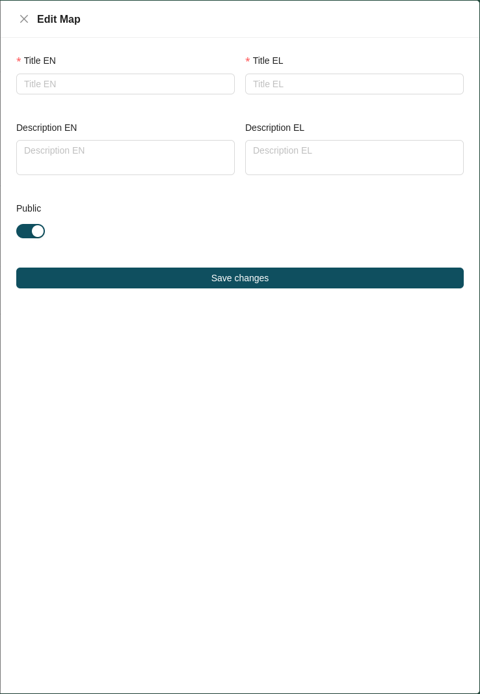

### Settings

The **Settings** action opens the **Map Editor**, an extended version of the Map Viewer. Because the two share the same interface, the tools are documented in the end-user manual rather than repeated here:

* [Map Viewer overview](https://geospatialenablingtechnologies.github.io/get.sdi.v.6.0.0-manual/map/)
* [Sidebar](https://geospatialenablingtechnologies.github.io/get.sdi.v.6.0.0-manual/map/sidebar/)
* [Toolbar](https://geospatialenablingtechnologies.github.io/get.sdi.v.6.0.0-manual/map/toolbar/)
* [Attribute Table](https://geospatialenablingtechnologies.github.io/get.sdi.v.6.0.0-manual/map/attribute-table/)
* [Right Click](https://geospatialenablingtechnologies.github.io/get.sdi.v.6.0.0-manual/map/right-click/)
* [Export and Import](https://geospatialenablingtechnologies.github.io/get.sdi.v.6.0.0-manual/map/export-import/)

The key difference is a **Save** icon next to the map [export and import configuration](https://geospatialenablingtechnologies.github.io/get.sdi.v.6.0.0-manual/map/export-import/) buttons, which lets administrators save the current map configuration.

!!! note

    The saved configuration is the one every user sees when they load the map, whether from the front page or the administration page.

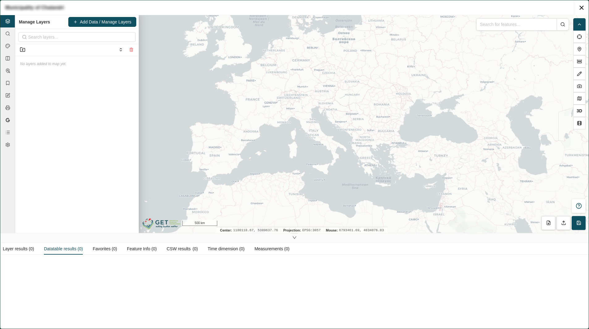
 
### Map Events

The **Map Events** action configures the [right-click map events](https://geospatialenablingtechnologies.github.io/get.sdi.v.6.0.0-manual/map/right-click/) available on the map. Clicking it opens the map events drawer, which lists all events configured for the map, each showing its **name** and the **GeoServer layer** it corresponds to.

The order of the events in this list is the order they appear in the right-click menu on the map. You can reorder them by dragging them within the list.

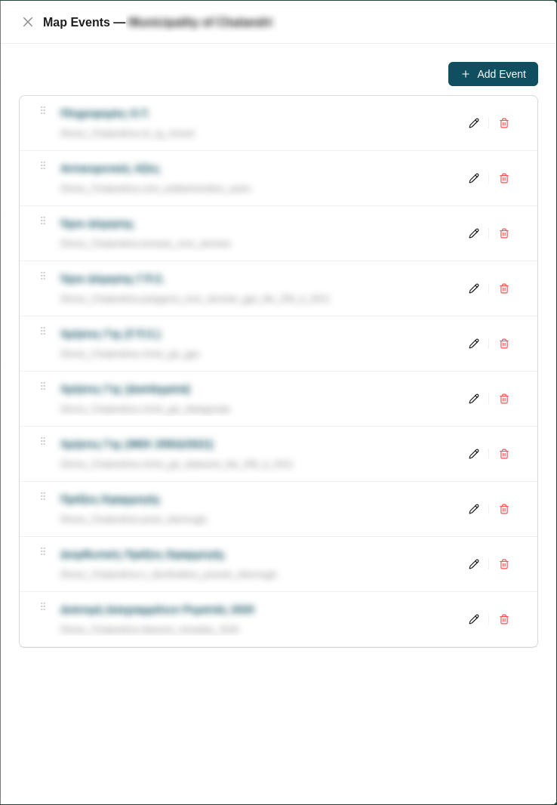

#### Creating a Map Event

To create a map event, click the **Add Event** button at the top right of the list. This opens the Add Event form.

1. Enter the event's **Title** in all required languages.
2. Configure the GeoServer source using one of two tabs, **Registered** or **Custom URL**, then select a layer.
3. Choose the event's layout: **List** or **Collapse**.

##### Registered

The **Registered** tab lets you select from the available registered [GeoServers](geoserver-management.md) and then choose one of its layers.

!!! note

    For registered GeoServers, layer access is role-based — you only see the layers permitted by the GeoServer assigned to your account and your role on that GeoServer.

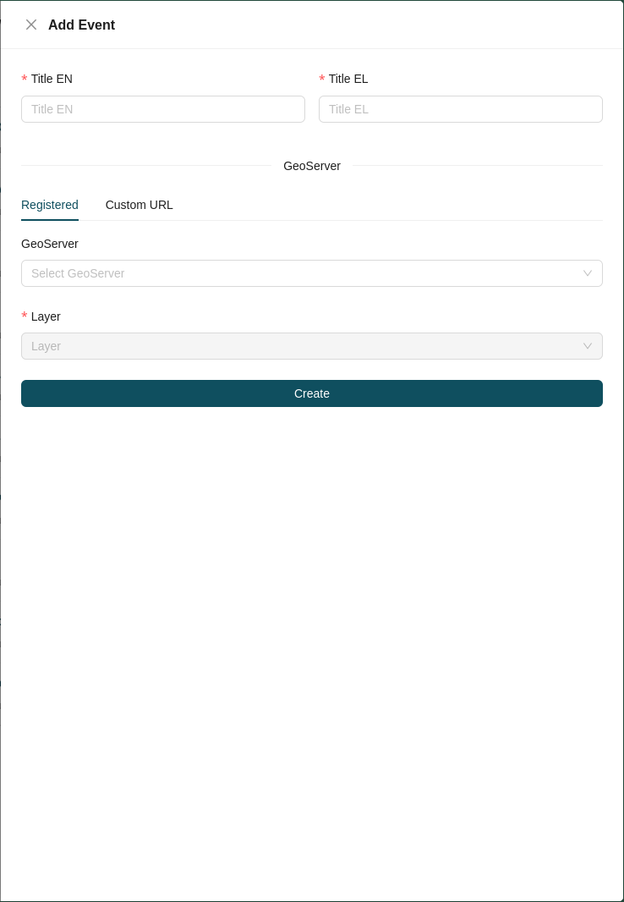

##### Custom URL

The **Custom URL** tab lets you type the URL of a GeoServer (ending in `/geoserver`) and select one of its publicly available layers.

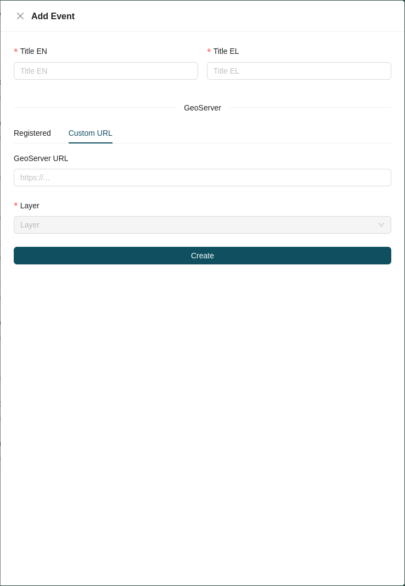

##### List Layout

In the **List** layout, you organize the event's information into one or more **categories**.

For each category:

1. Enter the **category title** in all required languages.
2. Select which items to display by moving them from the left **items list** to the right **items list**. Items are the attributes of the chosen layer.

The selected items appear as a list at the bottom of the form, where you can drag them to set the order in which they appear within the category.

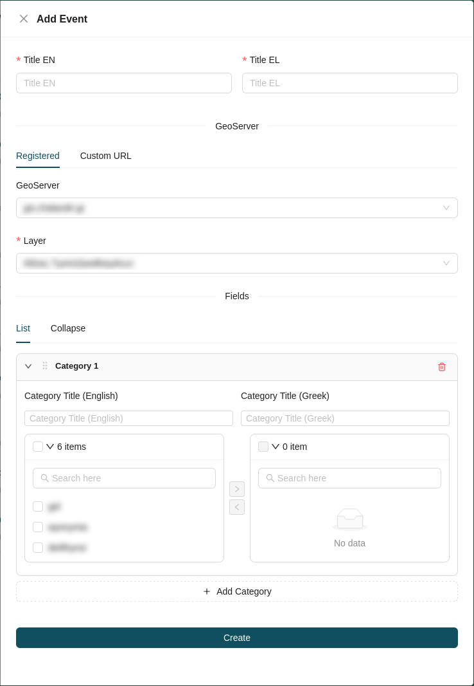

##### Collapse Layout

In the **Collapse** layout, you group the event's information by field. Select the **field to group by**, then select the **columns** to display as items.

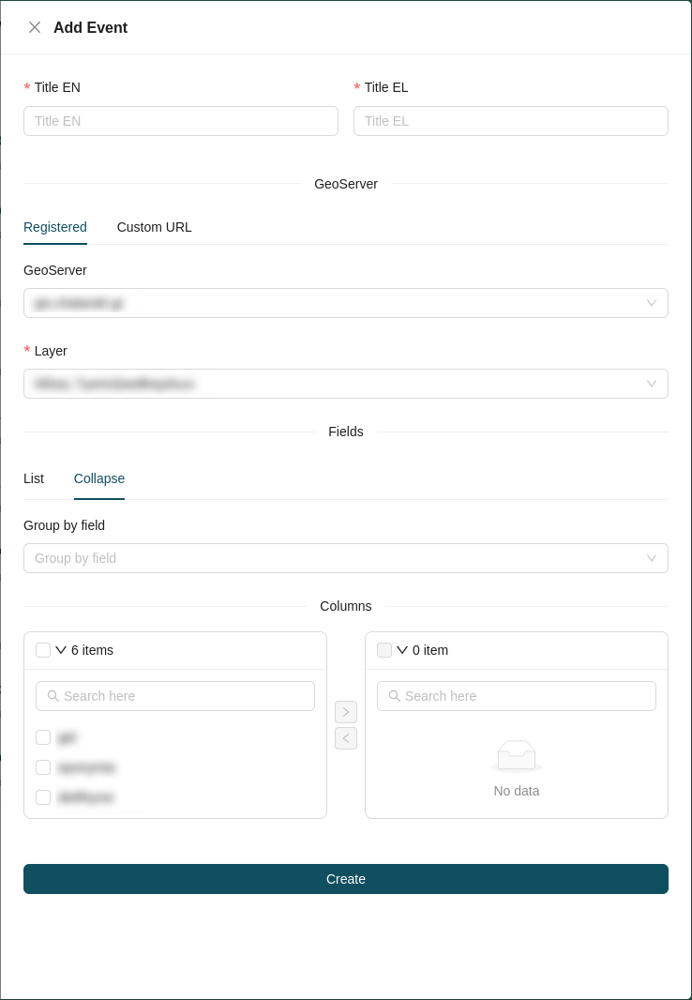

##### Configuring an Item

In both the **List** and **Collapse** layouts, the selected items are added, reordered, and configured the same way. Clicking an item expands its configuration form, where you can add a **Label** for the item in all required languages and choose a **display format** from the following options:

| Category | Available formats |
| :--- | :--- |
| **Currency** | Euro, Dollar, Pound, Euro (ISO code), Euro (full text), Euro (no decimals), Euro (3 decimals) |
| **Number** | Float, Float (1 decimal), Float (2 decimals), Float (3 decimals), Integer, Percentage, Percentage (1 decimal), Percentage (2 decimals), Compact short, Compact long |
| **Unit** | Square meters, Square kilometers, Hectares, Meters, Kilometers, Kilograms, Degrees Celsius |
| **Date** | Short, Long, Full |
| **Relative time** | Minutes, Hours, Days, Weeks, Months, Years |
| **Other** | Text, Text list, Link, Link list, Image, Image list, PDF, PDF list, Layer, Layer list |

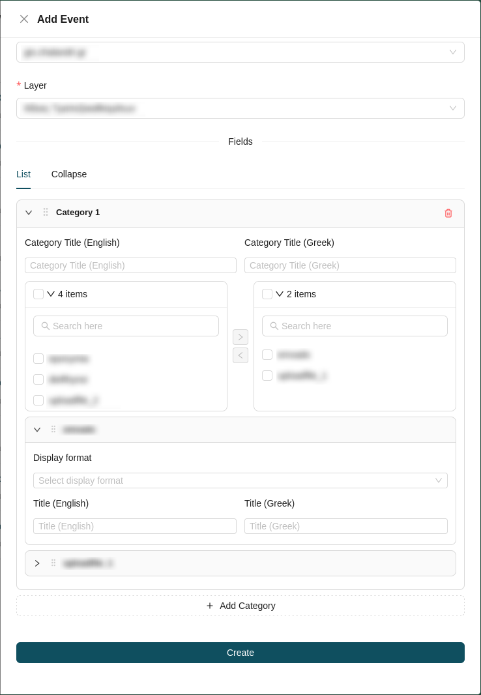

#### Map Event Actions

Each entry in the map events drawer provides the following actions:

| Icon | Action | Description |
| :---: | :--- | :--- |
|  | **[Edit](#edit-event)** | Modify the map event's configuration. |
|  | **[Delete](#delete-event)** | Permanently remove the map event from the map. |

##### Edit Map Event

The **Edit** action reopens the event form, where you can change the event's **Title**, **GeoServer** source and layer, **layout**, and item configuration.

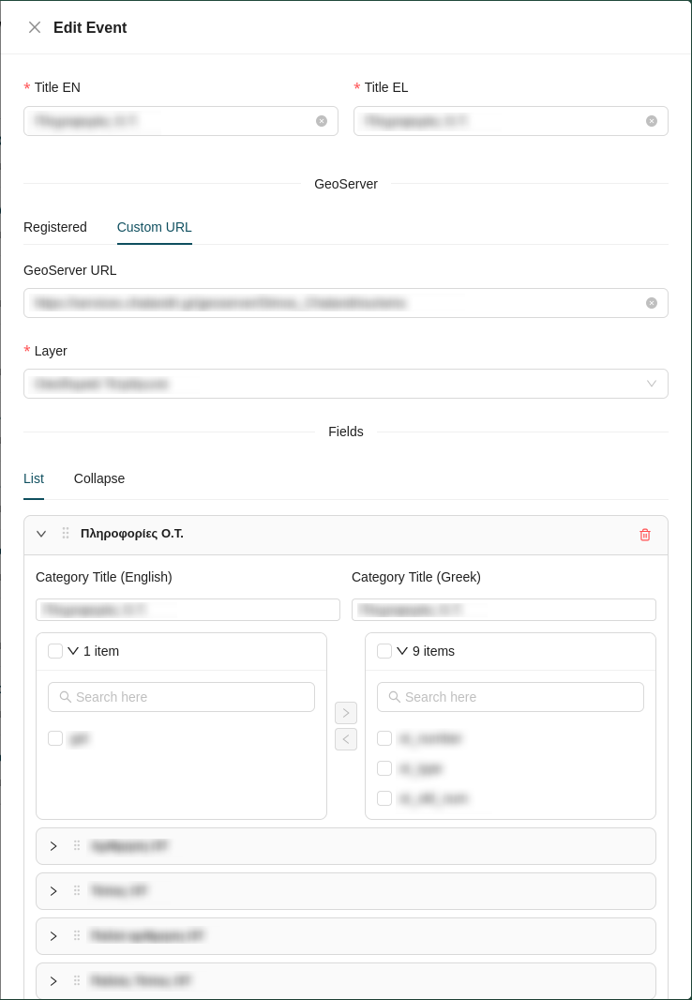

##### Delete Map Event

Clicking the **Delete** action permanently removes the map event from the map.

### Excerpt Print Configuration

The **Excerpt Print Configuration** action configures the print excerpts available for the map. Clicking it opens the print configurations drawer, which lists all configurations created for the map, each showing its **name** and the **layer** it corresponds to.

As with map events, the order of the configurations in this list can be changed by dragging them within the list.

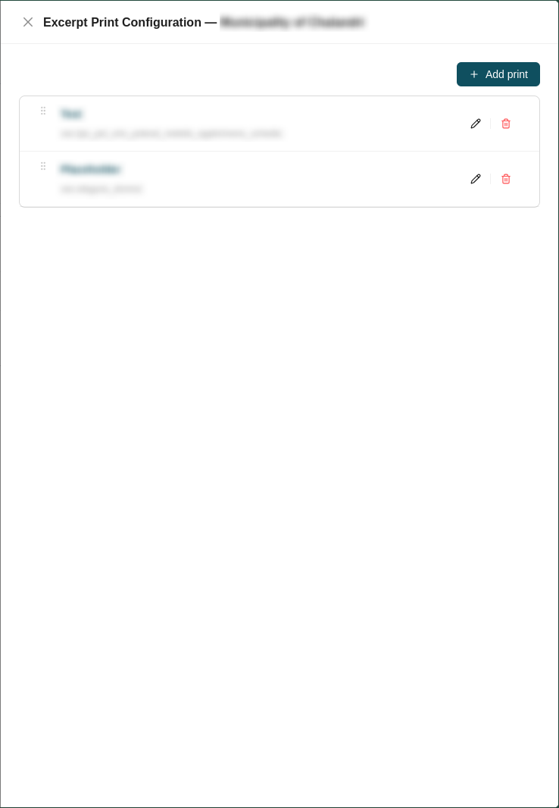

#### Creating a Print Configuration

To create a print configuration, click the **Add Print** button at the top right of the list. This opens the Add Print form.

Start by entering the configuration's title and index layer:

* **Title (EN):** The configuration title in English.
* **Title (EL):** The configuration title in Greek.
* **Index layer (GetFeatureInfo):** The layer queried to identify the printed feature.

The GeoServer source for the index layer is configured using one of two tabs, **Registered** or **Custom URL**.

##### Registered

The **Registered** tab lets you select from the available registered [GeoServers](geoserver-management.md) and then choose one of its layers:

* **GeoServer:** Select a GeoServer.
* **Layer name:** Select a layer.

!!! note

    As with map events, layer access for registered GeoServers is role-based, you only see the layers permitted by the GeoServer assigned to your account and your role on that GeoServer.

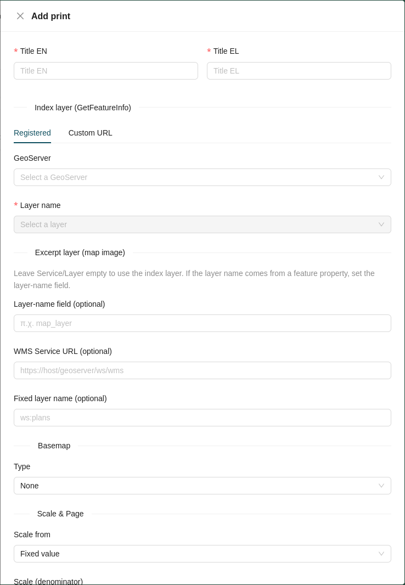

##### Custom URL

The **Custom URL** tab lets you type the URL of a GeoServer (ending in `/geoserver`) and select one of its publicly available layers.

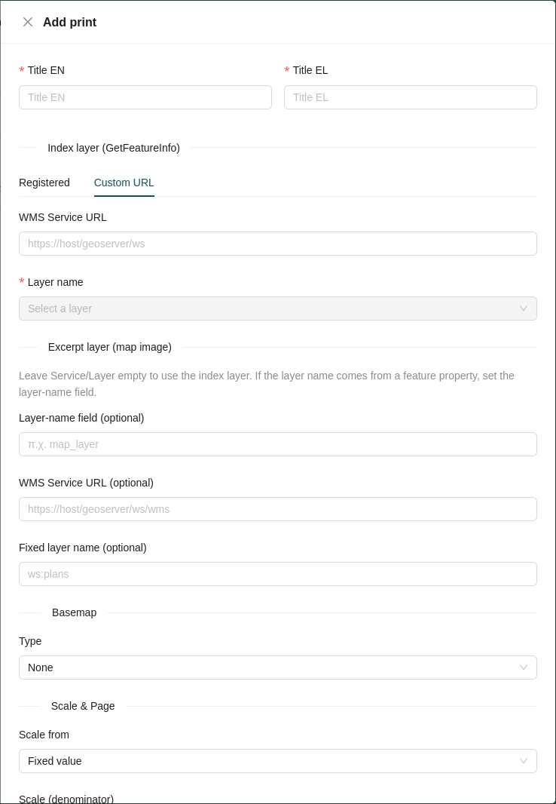

##### Excerpt Layer

The excerpt layer provides the map image for the printout.

!!! note

    Leave the **Service** / **Layer** empty to use the index layer. If the layer name comes from a feature property, set the **Layer-name field** instead.

* **Layer-name field** *(optional)*: The feature property to read the layer name from.
* **WMS Service URL** *(optional)*: The WMS service URL for the excerpt layer.
* **Fixed layer name** *(optional)*: A fixed layer name to use for the excerpt.

##### Basemap

* **Type:** The basemap to render beneath the excerpt (e.g. *None*).

##### Scale & Page

* **Scale from:** How the print scale is determined (e.g. *Fixed value*).
* **Scale (denominator):** The scale denominator to use.
* **Paper size:** The output paper size (e.g. *A4*).
* **Orientation:** The page orientation (e.g. *Portrait*).

##### Table Fields

Select the feature fields to include in the printout's table.

##### Texts

Configure the textual content of the printout. Text fields are provided in both required languages (EN / EL):

* **Disclaimer text (EN / EL):** Supports `{field}` placeholders.
* **Header title (EN / EL)**
* **Header subtitle (EN / EL)**
* **Logo URL** *(optional)*
* **Organization (footer) (EN / EL)**

##### Legend *(optional)*

* **Legend WMS Service URL:** The WMS service URL for the legend.
* **Legend Layer name:** The layer whose legend is displayed.

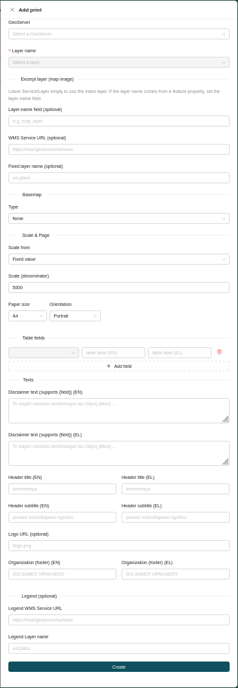

#### Print Configuration Actions

Each entry in the print configurations drawer provides the following actions:

| Icon | Action | Description |
| :---: | :--- | :--- |
|  | **[Edit](#edit-print-configuration)** | Modify the print configuration. |
|  | **[Delete](#delete-print-configuration)** | Permanently remove the print configuration from the map. |

##### Edit Print Configuration

The **Edit** action reopens the print configuration form, where you can change any of its settings.

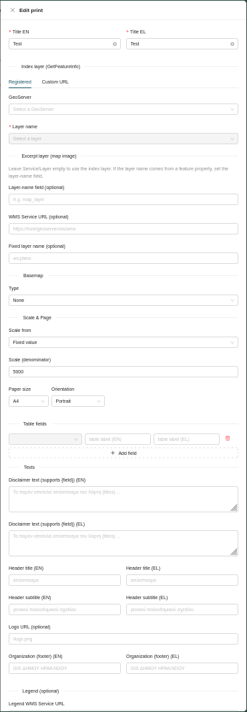

##### Delete Print Configuration

Clicking the **Delete** action permanently removes the print configuration from the map.

### Preview

The **Preview** action opens the map in the Map Viewer, exactly as an end user sees it when loading the map from the front page. The viewer and its tools are documented in the end-user manual:

* [Map Viewer overview](https://geospatialenablingtechnologies.github.io/get.sdi.v.6.0.0-manual/map/)

### Delete Map

Clicking the **Delete** action permanently removes the map from the workspace.