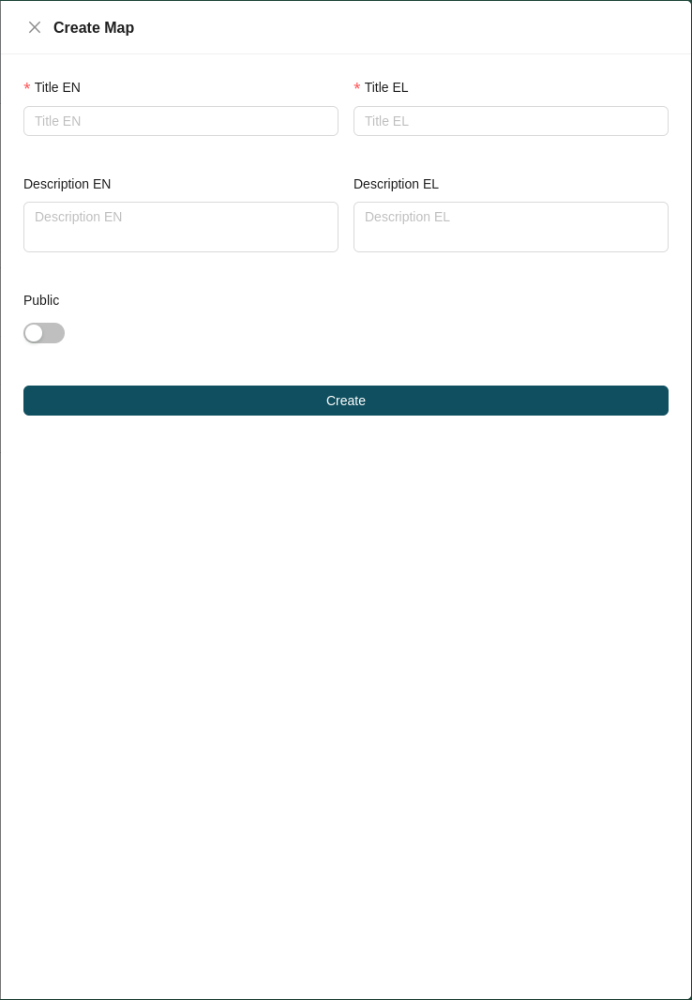

# Map Management

Inside a workspace, the **Maps** tab displays a list of all maps created for that workspace. Each map entry shows the map's **name**, **description**, and **visibility** (*Public* or *Private*).

## Creating a Map

To create a new map in the workspace, click the **plus** icon at the top right of the map list and select **Map** from the options. This opens the map creation form, where you fill in the following fields:

* **Title:** The map title, in all required languages.
* **Description** *(optional)*: A description of the map.
* **Visibility:** Choose whether the map is *Public* or *Private*.

!!! note

    Public maps are shown on the front page to all users without requiring a login. For the end-user view of a map, see the [GET SDI Portal Manual](https://geospatialenablingtechnologies.github.io/get.sdi.v.6.0.0-manual/).

## Map Actions

Each map in the list provides a set of available actions:

| Icon | Action | Description |
| :---: | :--- | :--- |
|  | **[Edit](#edit)** | Modify the map's details. |
|  | **[Settings](#settings)** | Configure the map's settings. |
|  | **[Map Events](#map-events)** | Configure the map's events. |
|  | **[Excerpt Print Configuration](#excerpt-print-configuration)** | Configure the map's excerpt print output. |
|  | **[Preview](#preview)** | Preview the map. |
|  | **[Delete](#delete)** | Permanently remove the map from the workspace. |

### Edit

TBD

### Settings

TBD

### Map Events

TBD

### Excerpt Print Configuration

TBD

### Delete

Clicking the **Delete** action permanently removes the map from the workspace.