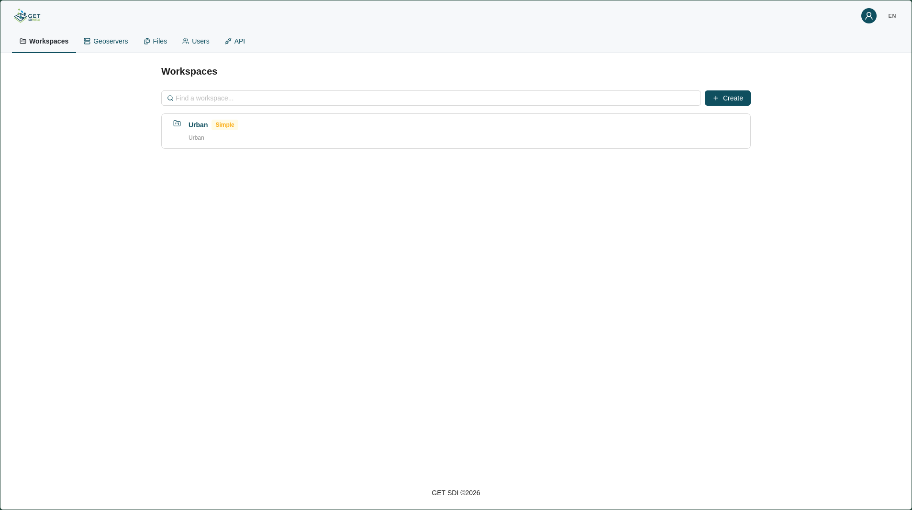
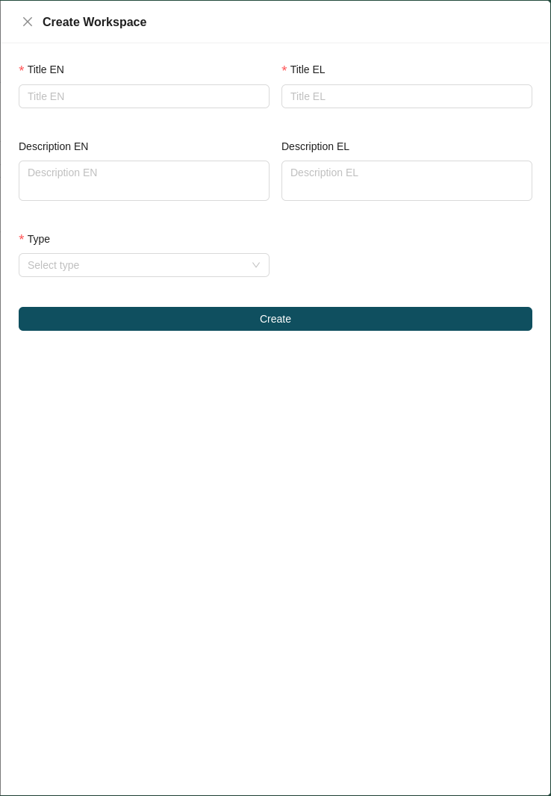
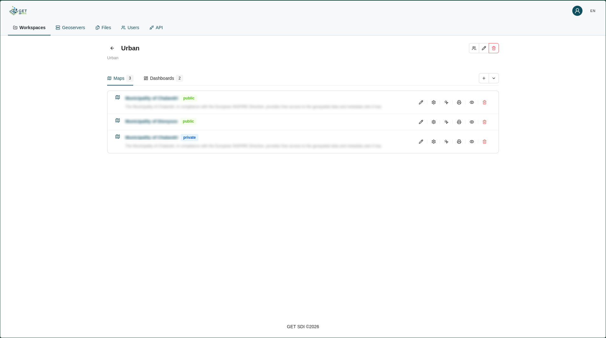
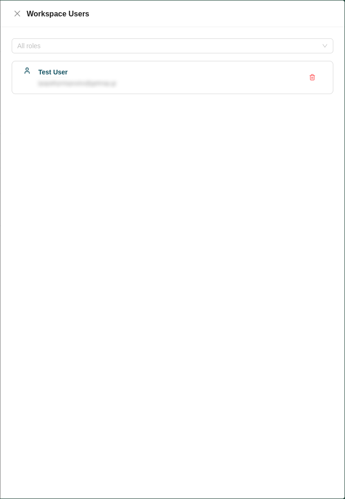
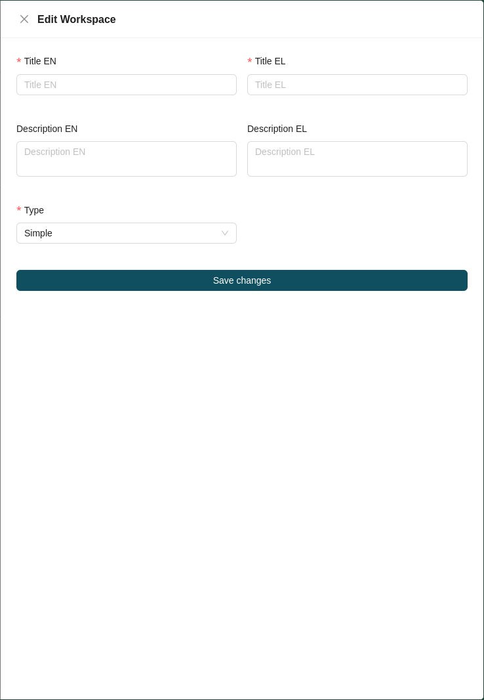

# Workspace Management

Workspaces let you organize maps and dashboards into specific groupings. Workspace management is handled from the **Workspaces** tab of the administration page. A searchable, paginated list of all available workspaces is displayed, with each entry showing the workspace's **name**, **type** (*Admin* or *Simple*), and **description**.

## Creating a Workspace

A superadmin can create a new workspace by clicking the **Create** button at the top right of the workspaces list. This opens a drawer on the right side of the page containing the workspace creation form. Fill in the following fields:

* **Title:** The workspace title, in all required languages.
* **Description** *(optional)*: The workspace description, in all required languages.
* **Type:** Select the workspace type: *Admin* or *Simple*.

Click **Create** to create the workspace.

## Workspace Content View

Clicking a workspace opens its content view, where the workspace's **name** and **description** are displayed. The content view is separated into two tabs:

* **Maps:** The maps belonging to the workspace.
* **Dashboards:** The dashboards belonging to the workspace.

## Workspace Actions

From the content view, the following actions are available for the workspace:

| Icon | Action | Description |
| :---: | :--- | :--- |
|  | **[Workspace Users](#workspace-users)** | Manage the users assigned to the workspace. |
|  | **[Edit](#edit)** | Modify the workspace's details. |
|  | **[Delete](#delete)** | Permanently remove the workspace from the platform. |

### Workspace Users

The **Workspace Users** action opens the workspace user management form. At the top is a dropdown for adding users to the workspace, followed by a list of the current workspace members. Each member is shown with their **Name**, **Surname**, and **email address**, and can be removed from the workspace by clicking the trashcan icon next to their entry.

### Edit

The **Edit** action opens the edit workspace form, where you can change the workspace's **Title** and **Description** (in all required languages) and its **Type**.

### Delete

Clicking the **Delete** action permanently removes the workspace from the platform.